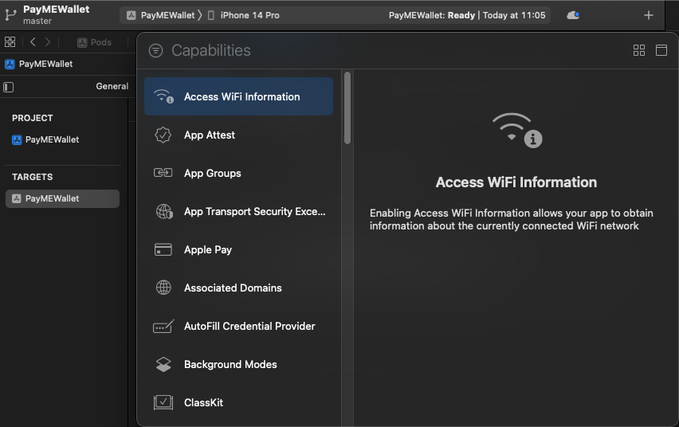

# payme-mini-app

[Cài đặt](#cài-đặt)

- [Cài thư viện](#cài-thư-viện)
- [Android](#android)
- [iOS](#ios)

[Cách sử dụng](#cách-sử-dụng)
<!-- - [Khởi tạo PayMEMiniApp](#khoi-tao-paymeminiapp) -->

# Cài đặt

## Cài thư viện 

```flutter
flutter pub add payme_miniapp_flutter
```

## Android
**Thêm maven jitpack.io**

Update file build.gradle project
```kotlin
allprojects {
  repositories {
    ...
    maven { 
        url "https://jitpack.io"
    }
 }
}
```

## iOS

Thêm vào cuối Podfile:

```swift
post_install do |installer|
  installer.pods_project.targets.each do |target|
    target.build_configurations.each do |config|
      config.build_settings['BUILD_LIBRARY_FOR_DISTRIBUTION'] = 'YES'
    end
  end
end
```

Trường hợp project của bạn không dùng framework, cần thay đổi build config để khai báo framework như sau:

```swift
$dynamic_framework = ['PayMEMiniApp', 'CryptoSwift', 'SwiftyRSA', 'GCDWebServer', 'NSLogger', 'lottie-ios', 'SwiftyJSON', 'ZIPFoundation', 'Mixpanel-swift']
 pre_install do |installer|
   installer.pod_targets.each do |pod|
     if $dynamic_framework.include?(pod.name)
       def pod.build_type;
       Pod::BuildType.dynamic_framework
      end
    end
  end
end
```

## Thiết lập application tương thích với PayMEMiniApp

### Info.plist

Cập nhật Info.plist những key như bên dưới để đảm bảo PayMEMiniApp có thể hoạt động


```swift
Privacy - Camera Usage Description
Privacy - Face ID Usage Description
Privacy - Photo Library Usage Description
Privacy - Photo Library Additions Usage Description
Privacy - Contacts Usage Description
Privacy - Location When In Use Usage Description
Privacy - Location Always Usage Description
```

Raw Keys version:

```swift
NSCameraUsageDescription
NSFaceIDUsageDescription
NSPhotoLibraryUsageDescription
NSPhotoLibraryAddUsageDescription
NSContactsUsageDescription
NSLocationWhenInUseUsageDescription
NSLocationAlwaysUsageDescription
```

### Thêm Capabilities

Ở XCode, chọn app của bạn ở mục Targets -> Signing & Capabilities -> Nhấn dấu "+" ở góc trên bên phải để mở cửa sổ thêm capability cho app



Tìm và chọn "Background Modes", bật lựa chọn "Background Fetch"


### Thiết lập cập nhật phiên bản PayMEMiniApp

Thêm dòng sau vào AppDelegate:

```swift
import UIKit
import PayMEMiniApp

@main
class AppDelegate: UIResponder, UIApplicationDelegate {
...
func application(_ application: UIApplication, handleEventsForBackgroundURLSession identifier: String, completionHandler: @escaping () -> Void) {
   completionHandler()
}
...
}
```

# Cách sử dụng

## Khởi tạo PayMEMiniApp

### Thiết lập bộ key từ PayME

Bộ key bao gồm: appId, publicKey, privateKey. Liên hệ PayME để được hướng dẫn.

### Khởi tạo Miniapp

<strong>*Việc khởi tạo này cũng sẽ bắt đầu việc kiểm tra và download phiên bản của PayMEMiniApp, do đó khuyến khích khởi tạo càng sớm càng tốt khi chạy app.*<strong>

| **Tham số**    | **Bắt buộc** | **Kiểu dữ liệu**                     |
| -------------- | ------------ | ------------------------------------ |
| **appId**      | Có           | String                               |
| **publicKey**  | Có           | String                               |
| **privateKey** | Có           | String                               |
| **env**        | Không        | String                               |
| **mode**       | Không        | String                               |

Chú thích:
- appId: mỗi đối tác tích hợp PayME Miniapp sẽ được cấp 1 appId riêng biệt
- publicKey, privateKey: cặp key được gen khi đăng ký đối tác với PayME
- env: Môi trường khởi tạo PayMEMiniApp (PRODUCTION, SANDBOX)
- mode: Chế độ sử dụng PayMEMiniApp (miniapp_sandbox, miniapp_product)

Ví dụ:
```dart
import 'package:payme_miniapp_flutter/payme_miniapp_flutter.dart';

Future<void> init() async {
    await PaymeMiniappFlutter.init(appId, publicKey, privateKey, env, mode);
}
```

### Set up các listeners:

Sử dụng hàm này để thiết lập việc hứng các events onResponse hoặc onError được bắn ra trong quá trình thao tác với Miniapp

```dart
import 'package:payme_miniapp_flutter/payme_miniapp_flutter.dart';

PaymeMiniappFlutter.onResponse.listen((dynamic response) {
    // response
});

PaymeMiniappFlutter.onError.listen((dynamic error) {
    // error
});
```

| **Tham số**    | **Bắt buộc** | **Kiểu dữ liệu**                         |
| -------------- | ------------ | ---------------------------------------- |
| **onResponse** | Không        | (ActionOpenMiniApp, JSONObject?) -> Unit |
| **onError**    | Không        | (ActionOpenMiniApp, PayMEError?) -> Unit |

Chú thích:
- onResponse: event onResponse được bắn khi kết thúc 1 action thao tác Miniapp (ví dụ: thanh toán thành công), event này được bắn kèm action tạo ra event này và 1 JSONObject chứa các dữ liệu thêm
- onError: event onError được bắn khi có lỗi xảy ra trong quá trình thao tác với Miniapp, event này được bắn kèm action đang thao tác và 1 PayMEError chứa thông tin thêm về lỗi

Chi tiết các kiểu dữ liệu

**ActionOpenMiniApp:** (action thao tác Miniapp)

| **Giá trị** | **Giải thích** |
|-----------------|-----------------------------------------------------------------------------------------------------------|
| **PAYME** | Dùng riêng cho app ví PayME |  
| **OPEN** | Nếu chưa kích hoạt tài khoản ví PayME thì kích hoạt, nếu đã kích hoạt thì mở giao diện trang chủ ví PayME |
| **PAY** | Mở giao diện thanh toán đơn hàng |
| **GET_BALANCE** | Lấy số dư ví PayME |
| **SERVICE** | Mở giao diện thanh toán dịch vụ |
| **DEPOSIT** | Mở giao diện nạp tiền |
| **WITHDRAW** | Mở giao diện rút tiền |
| **TRANSFER** | Mở giao diện chuyển tiền |
| **KYC** | Mở giao diện kyc |

**PayMEError:**(lỗi trong quá trình thao tác Miniapp)
| **Thuộc tính** | **Kiểu dữ liệu** | **Giải thích** |
|-------------------|-----------------------------------------|-------------------------------------------------------------------------------|
| **type** | enum "MiniApp", "UserCancel", "Network" | Nhóm lỗi: lỗi trong Miniapp, người dùng đóng Miniapp hoặc lỗi do kết nối mạng |  
| **code** | String | Mã lỗi |
| **description** | String | Miêu tả lỗi |


### Hàm openMiniApp:

Đối tác dùng hàm này để mở giao diện PayME Miniapp sau khi đã khởi tạo

```dart
import 'package:payme_miniapp_flutter/payme_miniapp_flutter.dart';

PaymeMiniappFlutter.open(openingType, openingParam);
```

| **Tham số**         | **Bắt buộc** | **Kiểu dữ liệu**         | **Giải thích**                                                       |
| ------------------- | ------------ | ------------------------ | -------------------------------------------------------------------- |
| **openingType**        | Có           | PayMEOpeningType | Mở Miniapp theo giao diện toàn màn hình hoặc modal truợt từ dưới lên |
| **openingParam** | Có           | PayMEOpeningParam | Thông tin thêm tùy vào loại action                                   |

Chi tiết các PayMEOpeningParam:

**OPEN:** đối tác dùng action này khi muốn mở giao diện trang chủ ví PayME để sử dụng các dịch vụ tiện ích của PayME. Nếu chưa kích hoạt tài khoản ví PayME thì kích hoạt, nếu đã kích hoạt thì mở giao diện trang chủ ví PayME
| **Thuộc tính** | **Bắt buộc** | **Kiểu dữ liệu** | **Giải thích** |
|---------------------|--------------|------------------|------------------------------|
| **phone** | Có | String | Số điện thoại của tài khoản |

Ví dụ:
```dart
import 'package:payme_miniapp_flutter/payme_miniapp_flutter.dart';
import 'package:payme_miniapp_flutter/payme_miniapp_type.dart';

Future<void> onOpenMiniApp() async {
    PayMEOpeningParam openingParam =
        PayMEOpeningParam.open(phone: '0123456789');

    await PaymeMiniappFlutter.open(PayMEOpeningType.modal, openingParam);
}
```

**PAY:** đối tác dùng action này khi muốn mở giao diện thanh toán của Miniapp
| **Thuộc tính** | **Bắt buộc** | **Kiểu dữ liệu** | **Giải thích** |
|---------------------|--------------|------------------|--------------------------------------------|
| **phone** | Có | String | Số điện thoại của tài khoản |
| **data** | Có | PaymentData | Thông tin thêm để phục vụ việc thanh toán |

Chi tiết PaymentData:
| **Thuộc tính** | **Bắt buộc** | **Kiểu dữ liệu** | **Giải thích** |
|---------------------|--------------|------------------|--------------------------------------------------------------------------------------|
| **transactionId** | Có | String | Mã giao dịch |  
| **amount** | Có | Int | Tổng số tiền giao dịch |  
| **note** | Không | String | Ghi chú của giao dịch |
| **ipnUrl** | Không | String | Đường dẫn để server PayME ipn đến khi giao dịch có tiến triển (thành công/thất bại) |

Ví dụ:
```dart
import 'package:payme_miniapp_flutter/payme_miniapp_flutter.dart';
import 'package:payme_miniapp_flutter/payme_miniapp_type.dart';

Future<void> onOpenMiniApp() async {
    PayMEOpeningParam openingParam = PayMEOpeningParam.pay(
        phone: '0123456789',
        data: PayMEPaymentParam(
            amount: 10000,
            transactionId: "121212",
            note: "abc",
            ipnUrl: "www.google.com"));

    await PaymeMiniappFlutter.open(PayMEOpeningType.modal, openingParam);
}
```

**DEPOSIT:** đối tác dùng action này khi muốn mở giao diện nạp tiền vào ví PayME
| **Thuộc tính** | **Bắt buộc** | **Kiểu dữ liệu** | **Giải thích** |
|---------------------|--------------|--------------------------------------|----------------------------------|
| **phone** | Có | String | Số điện thoại của tài khoản |
| **additionalData** | Có | PayMEPayParam | Thông tin thêm để phục vụ việc |

Ví dụ:
```dart
import 'package:payme_miniapp_flutter/payme_miniapp_flutter.dart';
import 'package:payme_miniapp_flutter/payme_miniapp_type.dart';

Future<void> onOpenDeposit() async {
    PayMEOpeningParam openingParam = PayMEOpeningParam.deposit(
        phone: '0795550300', data: PayMEPayParam(amount: 10000));

    await PaymeMiniappFlutter.open(PayMEOpeningType.modal, openingParam);
}
```

**WITHDRAW:** đối tác dùng action này khi muốn mở giao diện rút tiền ra ví PayME
| **Thuộc tính** | **Bắt buộc** | **Kiểu dữ liệu** | **Giải thích** |
|---------------------|--------------|--------------------------------------|----------------------------------|
| **phone** | Có | String | Số điện thoại của tài khoản |
| **additionalData** | Có | PayMEPayParam | Thông tin thêm để phục vụ việc |

Ví dụ:
```dart
import 'package:payme_miniapp_flutter/payme_miniapp_flutter.dart';
import 'package:payme_miniapp_flutter/payme_miniapp_type.dart';

Future<void> onOpenWithdraw() async {
    PayMEOpeningParam openingParam = PayMEOpeningParam.withdraw(
        phone: '0795550300', data: PayMEPayParam(amount: 10000));

    await PaymeMiniappFlutter.open(PayMEOpeningType.modal, openingParam);
}
```

**TRANSFER:** đối tác dùng action này khi muốn mở giao diện chuyển tiền
| **Thuộc tính** | **Bắt buộc** | **Kiểu dữ liệu** | **Giải thích** |
|---------------------|--------------|--------------------------------------|----------------------------------|
| **phone** | Có | String | Số điện thoại của tài khoản |
| **additionalData** | Có | PayMEPayParam | Thông tin thêm để phục vụ việc |

Ví dụ:
```dart
import 'package:payme_miniapp_flutter/payme_miniapp_flutter.dart';
import 'package:payme_miniapp_flutter/payme_miniapp_type.dart';

Future<void> onOpenTransfer() async {
    PayMEOpeningParam openingParam = PayMEOpeningParam.transfer(
        phone: '0795550300', data: PayMEPayParam(amount: 10000));

    await PaymeMiniappFlutter.open(PayMEOpeningType.modal, openingParam);
}
```

Chi tiết PayMEPayParam:
| **Thuộc tính** | **Bắt buộc** | **Kiểu dữ liệu** | **Giải thích** |
|---------------------|--------------|------------------|-------------------------------------------------------|
| **description** | Không | String | Miêu tả giao dịch |  
| **amount** | Không | Int | Tổng số tiền giao dịch |

**KYC:** đối tác dùng action này khi muốn mở giao diện kyc
| **Thuộc tính** | **Bắt buộc** | **Kiểu dữ liệu** | **Giải thích** |
|---------------------|--------------|--------------------------------------|----------------------------------|
| **phone** | Có | String | Số điện thoại của tài khoản |

Ví dụ:
```dart
import 'package:payme_miniapp_flutter/payme_miniapp_flutter.dart';
import 'package:payme_miniapp_flutter/payme_miniapp_type.dart';

Future<void> onOpenKYC() async {
    PayMEOpeningParam openingParam = PayMEOpeningParam.kyc(phone: '0795550300');

    await PaymeMiniappFlutter.open(PayMEOpeningType.modal, openingParam);
}
```

**SERVICE:** đối tác dùng action này khi muốn mở giao diện kyc
| **Thuộc tính** | **Bắt buộc** | **Kiểu dữ liệu** | **Giải thích** |
|---------------------|--------------|--------------------------------------|----------------------------------|
| **phone** | Có | String | Số điện thoại của tài khoản |
| **additionalData** | Có | PayMEOpeningParam | Thông tin thêm để phục vụ việc |

Chi tiết PayMEOpeningParam:
| **Thuộc tính** | **Bắt buộc** | **Kiểu dữ liệu** | **Giải thích** |
|---------------------|--------------|------------------|-------------------------------------------------------|
| **code** | Không | String | Mã dịch vụ |

Danh sách mã dịch vụ:

| **Giá trị** | **Giải thích** |
|-----------------|-----------------------------------------------------------------------------------------------------------|
| **POWE** | Điện |  
| **WATE** | Nước |
| **ADSL** | Internet |
| **TIVI** | Truyền hình |
| **PPMB** | Điện thoại trả sau |
| **MOBILE_CARD** | Thẻ điện thoại |
| **MOBILE_TOPUP** | Nạp điện thoại |
| **GAME_CARD** | Thẻ game |

Ví dụ:
```dart
import 'package:payme_miniapp_flutter/payme_miniapp_flutter.dart';
import 'package:payme_miniapp_flutter/payme_miniapp_type.dart';

Future<void> onOpenService() async {
    PayMEOpeningParam openingParam = PayMEOpeningParam.service(phone: '0795550300', data: PayMEServiceParam(service: 'POWE'));

    await PaymeMiniappFlutter.open(PayMEOpeningType.modal, openingParam);
}
```

### Hàm getBalance

Đối tác dùng hàm này để lấy thông tin số dư ví PayME của tài khoản, kết quả sẽ được trả về ở event onResponse, action GET_BALANCE

```dart
import 'package:payme_miniapp_flutter/payme_miniapp_flutter.dart';

Future<void> getBalance() async {
    await PaymeMiniappFlutter.getBalance('0795550300');
}
```

| **Tham số** | **Bắt buộc** | **Kiểu dữ liệu** | **Giải thích**                                                      |
| ----------- | ------------ | ---------------- | ------------------------------------------------------------------- |
| **phone**   | Có           | String           | Số điện thoại của tài khoản cần lấy số dư ví (không cần format +84) |

### Hàm getAccountInfo

Đối tác dùng hàm này để lấy thông tin tài khoản PayME, kết quả sẽ được trả về ở event onResponse, action GET_ACCOUNT_INFO

```dart
import 'package:payme_miniapp_flutter/payme_miniapp_flutter.dart';

Future<void> getAccountInfo() async {
    await PaymeMiniappFlutter.getAccountInfo('0795550300');
}
```

| **Tham số** | **Bắt buộc** | **Kiểu dữ liệu** | **Giải thích**                                                      |
| ----------- | ------------ | ---------------- | ------------------------------------------------------------------- |
| **phone**   | Có           | String           | Số điện thoại của tài khoản cần lấy số dư ví (không cần format +84) |
